# Лабораторная работа № 6. Безусловный экстремум.

Выполнил студент группы 428  
Шаров Федор Денисович

## Вариант № 09

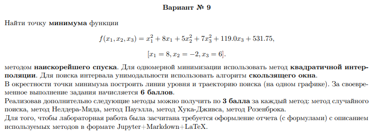

## Теоретическая часть
Задача на поиск точки миниума функции

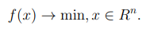

Такую задачу можно решить с помощью итерационный методов

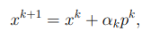

Метод наискорейшего спуска - это метод первого порядка. У него вектор p совпадает с градиентом.
В этом методе на каждом шаге необходимо решать задачу минимизации функции одной переменной.

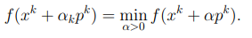

Т.е. нужно находить альфа k-ое с помощью одномерной минимизации.
В данном варианте - это метод квадратичной интерполяции.
Метод заключается в замене нелинейной функции квадратичной параболой, построенной по трем точкам, принадлежащим функции, с последующим нахождением минимума параболической функции. Где точка минимума находится по формуле 

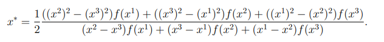

Методы одномерной минимизации работают на интервале унимодальности, которые находим с помощью алгоритма скользящего окна.
Для выбранной исходной точки и выбраного окна шириной 2h > 0 около точки x0 проверяктся условие унимодальности

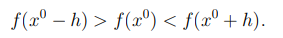

Если условие выполнено, то считается, что интервал унимодальности найден, в противном случае интервал сдвигается
## Практическая часть
В prog.cpp:
* void SelectionSort(vector<double> &array, vector<double> &array2, int size) упорядочивает 2 массива(аргумент, значение) для дальнейшего вывода графика функции.
* double func(double x1, double x2, double x3) возвращает значение нашей функции.
* double f(double t, double x1, double x2, double x3, double grad1, double grad2, double grad3) возвращает значение нашей функции при x, зависящем от градиента и альфа k-ое(в программе t).
* double Method_kvadr_interpol(double a, double b, double h, double epsilon, double x1, double x2, double x3, double grad1, double grad2, double grad3) - это метод квадратичной интерполяции.
* void Skolz_okno(double &a, double &b, double x0, double h, double x1, double x2, double x3, double grad1, double grad2, double grad3) - это алгоритм скользящего окна.
* void Method_naiskor_spuska(double epsilon, double x01, double x02, double x03, double &x1_finish, double &x2_finish, double &x3_finish) - метод наискорейшего спуска.
Сначала компилирует prog.cpp и при запуске задаются начальная точка, погрешность, после это выводятся число итераций, точка минимума, и функция в этой точке . Интерпретируются файлы питон для вывода графиков.
### Результаты
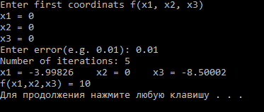
  
В результате работы программы у функции

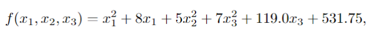

был найден экстремум в точке (-3.99826, 0, -8.50002) (начальная точка (0, 0, 0)) за 5 итераций методом наискорейшего спуска с точностью 0.01. Ниже приведены рисунки для случая функции трех переменных с изображением линий уровня анализируемой функции и траектория поиска экстремума:
  ### График x2=f(x1) при x3=x3s
  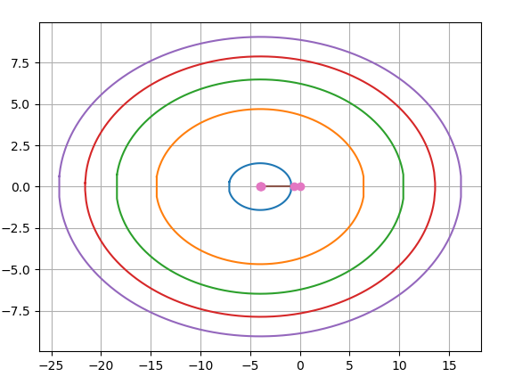
  ### График x2=f(x3) при x1=x1s
  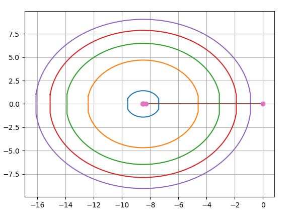
  ### График x1=f(x3) при x2=x2s
  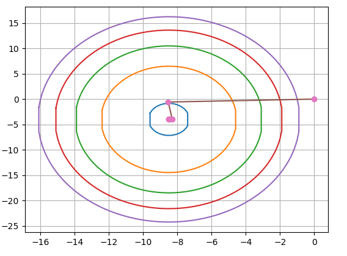
